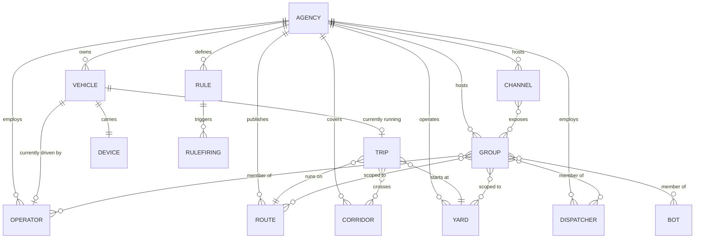
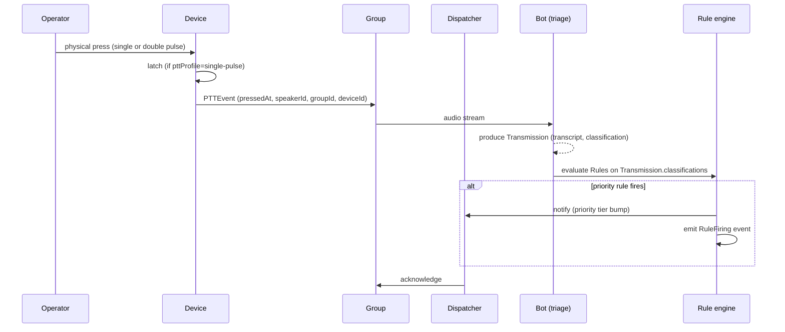
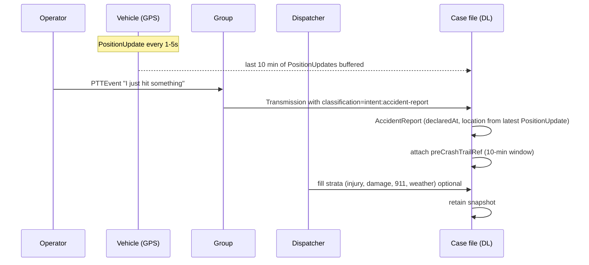

# Overview Diagrams

## Entity relationships

```mermaid
erDiagram
    AGENCY ||--o{ VEHICLE : owns
    AGENCY ||--o{ OPERATOR : employs
    AGENCY ||--o{ DISPATCHER : employs
    AGENCY ||--o{ ROUTE : publishes
    AGENCY ||--o{ YARD : operates
    AGENCY ||--o{ CORRIDOR : covers
    AGENCY ||--o{ GROUP : hosts
    AGENCY ||--o{ CHANNEL : hosts
    AGENCY ||--o{ RULE : defines

    VEHICLE ||--o| OPERATOR : "currently driven by"
    VEHICLE ||--o| TRIP : "currently running"
    VEHICLE ||--|| DEVICE : "carries"

    TRIP }o--|| ROUTE : "runs on"
    TRIP }o--o{ CORRIDOR : "crosses"
    TRIP }o--|| YARD : "starts at"

    GROUP }o--o{ OPERATOR : "member of"
    GROUP }o--o{ DISPATCHER : "member of"
    GROUP }o--o{ BOT : "member of"
    GROUP }o--o{ ROUTE : "scoped to"
    GROUP }o--o{ YARD : "scoped to"

    CHANNEL }o--o{ GROUP : "exposes"

    RULE ||--o{ RULEFIRING : "triggers"
```

## Event flow around a PTT press

```mermaid
sequenceDiagram
    participant Op as Operator
    participant Dev as Device
    participant Grp as Group
    participant Dsp as Dispatcher
    participant Bot as Bot (triage)
    participant Rule as Rule engine

    Op->>Dev: physical press (single or double pulse)
    Dev->>Dev: latch (if pttProfile=single-pulse)
    Dev->>Grp: PTTEvent (pressedAt, speakerId, groupId, deviceId)
    Grp->>Bot: audio stream
    Bot-->>Bot: produce Transmission (transcript, classification)
    Bot->>Rule: evaluate Rules on Transmission.classifications
    alt priority rule fires
        Rule->>Dsp: notify (priority tier bump)
        Rule->>Rule: emit RuleFiring event
    end
    Dsp->>Grp: acknowledge
```

## Event flow around an accident

```mermaid
sequenceDiagram
    participant Op as Operator
    participant Veh as Vehicle (GPS)
    participant Grp as Group
    participant Dsp as Dispatcher
    participant Case as Case file (DL)

    Note over Veh: PositionUpdate every 1-5s
    Veh-->>Case: last 10 min of PositionUpdates buffered
    Op->>Grp: PTTEvent "I just hit something"
    Grp->>Case: Transmission with classification=intent:accident-report
    Case->>Case: AccidentReport (declaredAt, location from latest PositionUpdate)
    Case->>Case: attach preCrashTrailRef (10-min window)
    Dsp->>Case: fill strata (injury, damage, 911, weather) optional
    Case->>Case: retain snapshot
```
